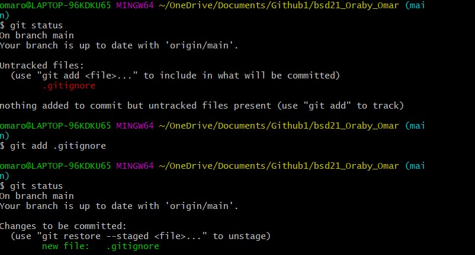

## This is my second exercise with markdown

### Working with git status

as you can see, although I wrote the files I want to ignore into the .gitignore, the file .gitignore is untracked and is written in red. So to get an easy solution, I added  .gitignore into my repository. So now, when I enter **git staus**, no more files are untracked.

 ### Basic commands
 **git add**
The git add command adds new or changed files in your working directory to the Git staging area.

 **git commit -m**
 without git add, no git commit would ever do anything.
 Commit set a message about the changes you were done. The commit also saves a revision of the code and you can revert the code to any version anytime in one click.