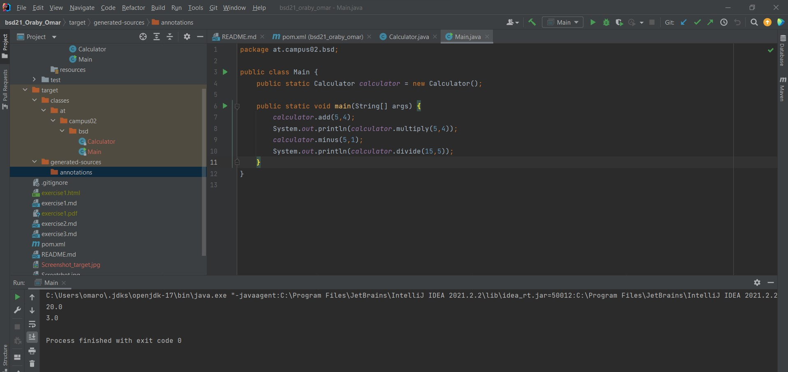

Ich habe das Projekt Maven nach der installieren von Maven und nach der aktualisiersung der Path-Variable, erstellt.

Nachdem ich .idea file in das .gitignore file reingeschoben habe, erstellte ich die benötigten Java-Klassen und habe das programm laufen gelassen.

Das Target-File wird von Maven erstellt. Es enthält alle kompilierten Klassen, JAR-Dateien usw. Wenn der Befehl mvn clean ausgeführt wird, säubert Maven das Zielverzeichnis.
