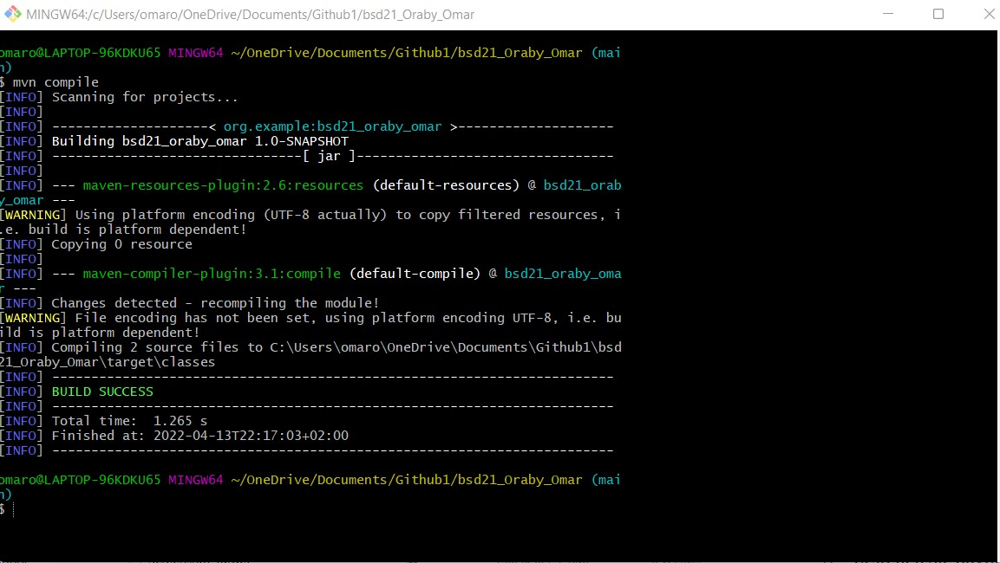

I created the Maven project after installing Maven and updating the path variable.

After moving the .idea file into the .gitignore file, I created the required Java classes and ran the program.

The target file is created by Maven. It contains all the compiled classes, JAR files, etc. When the mvn clean command is run, Maven cleans the target directory.

mvn compile: This command is used to compile the source code. It also compiles the classes that are stored at a particular target or class.

